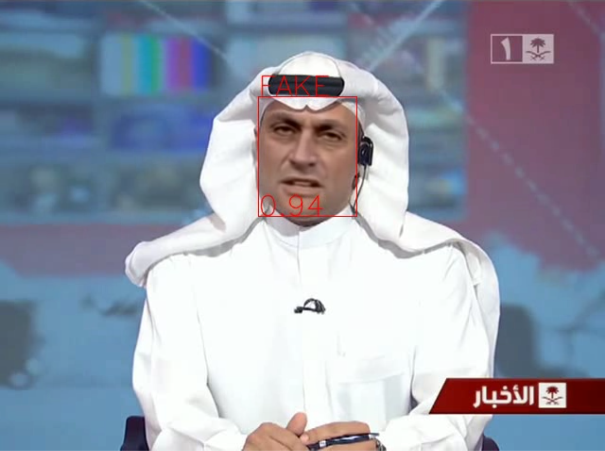

<p align="center">
  <h1 align="center">[CVPR'25] Towards More General Video-based Deepfake Detection through Facial Component Guided Adaptation for Foundation Model (DFD-FCG)</h1>

  <p align="center">
    <a href="https://github.com/ODD2"><strong>Yue-Hua Han</strong></a>
    <sup>1,3,4</sup>
    &nbsp;&nbsp;
    <a href="https://github.com/Teddy12155555"><strong>Tai-Ming Huang</strong></a>
    <sup>1,3,4</sup>
    &nbsp;&nbsp;
    <a href="https://scholar.google.com/citations?user=nnzQtDAAAAAJ&hl=zh-TW"><strong>Kai-Lung Hua</strong></a>
    <sup>2,4</sup>
    &nbsp;&nbsp;
    <a href="https://scholar.google.com.au/citations?user=3x9KITUAAAAJ&hl=en"><strong> Jun-Cheng Chen</strong></a>
    <sup>1</sup>
    <br>
    <!-- <sup>1</sup>Academia Sinica&nbsp;
    <sup>2</sup>Microsoft&nbsp;
    <sup>3</sup>National Taiwan University&nbsp;
    <br>
    <sup>4</sup>National Taiwan University of Science and Technology&nbsp; -->
    <sup>1</sup>Academia Sinica,</span>&nbsp;
    <sup>2</sup>Microsoft,</span>&nbsp;
    <sup>3</sup>National Taiwan University,</span>&nbsp;
    <br>
    <sup>4</sup>National Taiwan University of Science and Technology</span>&nbsp;
    <br>
    <a href='https://arxiv.org/abs/2404.05583'></a>&nbsp;
    
  </p>
</p>

## 🥇Abstract
<div style="text-align: justify">  
Generative models have enabled the creation of highly realistic facial-synthetic images, raising significant concerns due to their potential for misuse. Despite rapid advancements in the field of deepfake detection, developing efficient approaches to leverage foundation models for improved generalizability to unseen forgery samples remains challenging. To address this challenge, we propose a novel side-network-based decoder that extracts spatial and temporal cues using the CLIP image encoder for generalized video-based Deepfake detection. Additionally, we introduce Facial Component Guidance (FCG) to enhance spatial learning generalizability by encouraging the model to focus on key facial regions. By leveraging the generic features of a vision-language foundation model, our approach demonstrates promising generalizability on challenging Deepfake datasets while also exhibiting superiority in training data efficiency, parameter efficiency, and model robustness.
</div>

## 📝TODOs
  - [x] Training + Evaluation Code
  - [x] Model Weights
  - [x] Inference Code
  - [ ] HeyGen Evaluation Dataset


## 🙌News
  - June 08: We have released the [model checkpoint](https://drive.google.com/file/d/1ydD5rnaaF0i2zLE7NidLtAhjonHoVQOk/view?usp=sharing) and provided inference code for single videos! Checkout [this section](#inference---demo-video) for further details!

## 🚀Installation
```shell
# conda environment
conda env create -f environment.yml
```

## 📂Dataset Structure
The structure of the **pre-processed datasets** for our project, the video files (*.avi) have been processed to only retain the aligned face. We use soft-links **(ln -s)** to manage and link the folders containing pre-processed videos on different drives.
```shell
datasets
├── cdf
│   ├── FAKE
│   │   └── videos
│   │         └── *.avi
│   ├── REAL
│   │   └── videos
│   │         └── *.avi
│   └── csv_files
│       ├── test_fake.csv
│       └── test_real.csv
├── dfdc
│   ├── csv_files
│   │   └── test.csv
│   └── videos
├── dfo
│   ├── FAKE
│   │   └── videos
│   │         └── *.avi
│   ├── REAL
│   │   └── videos
│   │         └── *.avi
│   └── csv_files
│       ├── test_fake.csv
│       └── test_real.csv
├── ffpp
│   ├── DF
│   │   ├── c23
│   │   │   └── videos
│   │   │         └── *.avi
│   │   ├── c40
│   │   │   └── videos
│   │   │         └── *.avi
│   │   └── raw
│   │       └── videos
│   │   │         └── *.avi
│   ├── F2F ...
│   ├── FS ...
│   ├── FSh ...
│   ├── NT ...
│   ├── real ...
│   └── csv_files
│       ├── test.json
│       ├── train.json
│       └── val.json
|   
└── robustness
    ├── BW
    │   ├── 1
    │   │   ├── DF
    │   │   │   └── c23
    │   │   │       └── videos
    │   │   │             └── *.avi
    │   │   ├── F2F ...
    │   │   ├── FS ...
    │   │   ├── FSh ...
    │   │   ├── NT ...
    │   │   ├── real ...
    │   │   │
    │   │   └── csv_files
    │   │       ├── test.json
    │   │       ├── train.json
    │   │       └── val.json
    │   │   
    │   │   
    │   │   
    .   .
    .   .
    .   .
```


## 🔧Dataset Pre-processing
### Generic Pre-processing
This phase performs the required pre-processing for our method, this includes *facial alignment (using the mean face from LRW)* and *facial cropping*.
```bash
# First, fetch all the landmarks & bboxes of the video frames.
python -m src.preprocess.fetch_landmark_bbox \ 
--root-dir="/storage/FaceForensicC23" \ # The root folder of the dataset
--video-dir="videos" \  # The root folder of the videos
--fdata-dir="frame_data" \ # The folder to save the extracted frame data
--glob-exp="*/*" \  # The glob expression to search through the root video folder
--split-num=1 \ # Split the dataset into several parts for parallel process.
--part-num=1 \ # The part of dataset to process  for parallel process.
--batch=1 \ # The batch size for the 2D-FAN face data extraction. (suggestion: 1)
--max-res=800  # The maximum resolution for either side of the image

# Then, crop all the faces from the original videos.
python -m src.preprocess.crop_main_face \ 
--root-dir="/storage/FaceForensicC23/" \ # The root folder of the dataset
--video-dir="videos" \  # The root folder of the videos
--fdata-dir="frame_data" \ # The folder to fetch the frame data for landmarks and bboxes
--glob-exp="*/*" \  # The glob expression to search through the root video folder
--crop-dir="cropped" \ # The folder to save the cropped videos
--crop-width=150 \ # The width for the cropped videos
--crop-height=150 \ # The height for the cropped videos
--mean-face="./misc/20words_mean_face.npy" # The mean face for face aligned cropping. 
--replace \ # Control whether to replace existing cropped videos
--workers=1 # Number of works to perform parallel process (default: cpu / 2 )
```


### Robustness Pre-processing
This phase requires the pre-processed facial landmarks to perform facial cropping, please refer to the **Generic Pre-processing** for further detail.
```bash
# First, we add perturbation to all the videos.
python -m src.preprocess.phase1_apply_all_to_videos \ 
--dts-root="/storage/FaceForensicC23" \ # The root folder of the dataset
--vid-dir="videos" \  # The root folder of the videos
--rob-dir="robustness" \ # The folder to save the perturbed videos
--glob-exp="*/*.mp4" \  # The glob expression to search through the root video folder
--split=1 \ # Split the dataset into several parts for parallel process.
--part=1 \ # The part of dataset to process  for parallel process.
--workers=1  # Number of works to perform parallel process (default: cpu / 2 )

# Then, crop all the faces from the perturbed videos.
python -m src.preprocess.phase2_face_crop_all_videos \ 
(setup/run/clean) # the three phase operations
--root-dir="/storage/FaceForensicC23/" \ # The root folder of the dataset
--rob-dir="videos" \  # The root folder of the robustness videos
--fd-dir="frame_data" \ # The folder to fetch the frame data for landmarks and bboxes
--glob-exp="*/*/*/*.mp4" \  # The glob expression to search through the root video folder
--crop-dir="cropped_robust" \ # The folder to save the cropped videos
--mean-face="./misc/20words_mean_face.npy" \ # The mean face for face aligned cropping. 
--workers=1  # Number of works to perform parallel process (default: cpu / 2 )
```

## 🤖Training & Evaluation
### Training - Preset Settings 
In `./scripts`,  scripts are provided to start the training process for the settings mentioned in our paper. 
These settings are configured to run on a cluster with `V100*4`.
```bash
bash ./scripts/model/ffg_l14.sh # begin training process
```
### Training - Custom Settings
Our project is built on `pytorch-lightning (2.2.0)`, please refer the  [official manual](https://lightning.ai/docs/pytorch/2.2.0/common/trainer.html#trainer-class-api) and adjust the following files for advance configurations:
```bash
./configs/base.yaml # major training settings (e.g. epochs, optimizer, batch size, mixed-precision ...)
./configs/data.yaml # settings for the training & validation dataset
./configs/inference.yaml # settings for the evaluation dataset (extension of data.yaml)
./configs/logger.yaml # settings for the WandB logger
./configs/clip/L14/ffg.yaml # settings for the main model 
./configs/test.yaml # settings for debugging (offline logging, small batch size, short epochs ...)
```
The following command starts the training process with the provided settings:
```bash
# For debugging, add '--config configs/test.yaml' after the '--config configs/clip/L14/ffg.yaml'.
python main.py \
--config configs/base.yaml \
--config configs/clip/L14/ffg.yaml

# Fine-grained control is supported with the pytorch-lightning-cli.
python main.py \
--config configs/base.yaml \
--config configs/clip/L14/ffg.yaml \
--optimizer.lr=1e-5 \
--trainer.max_epochs=10 \
--data.init_args.train_datamodules.init_args.batch_size=5
```
### Evaluation - Standard
To perform evaluation on datasets, run the following command:
```bash
python inference.py \
"logs/fcg_l14/setting.yaml" \ # model settings
"./configs/inference.yaml" \ # evaluation dataset settings
"logs/fcg_l14/checkpoint.ckpt" \ # model checkpoint
"--devices=4" # number of devices to compute in parallel
```
### Evaluation - Robustness
We provide tools in `./scripts/tools/` to simplify the robustness evaluation task: `create-robust-config.sh` creates an evaluation config for each perturbation types and `inference-robust.sh` runs through all the datasets with the specified model.

## 😎Inference - Demo Video
To run inference on a single video with an indicator, please download our model checkpoint and execute the following commands:
```bash
# Pre-Processing: fetch facial landmark and bounding box
python -m src.preprocess.fetch_landmark_bbox \
--root-dir="./resources" \
--video-dir="videos" \
--fdata-dir="frame_data" \
--glob-exp="*"
# Pre-Processing: crop out the facial regions
python -m src.preprocess.crop_main_face \
--root-dir="./resources" \
--video-dir="videos" \
--fdata-dir="frame_data" \
--crop-dir="cropped" \
--glob-exp="*"
# Main Process
python -m demo \
"checkpoint/setting.yaml" \ # the model setting of the checkpoint
"checkpoint/weights.ckpt" \ # the model weights of the checkpoint
"resources/videos/000.mp4" \ # the video to process
--out_path="test.avi" \ # the output path of the processed video
--threshold=0.5 \ # the threshold for the real/fake indicator
--batch_size=30 # the input batch size of the model (~10G VRAM when batch_size=30 )
```
The following is a sample frame from the processed video:
<p align="center">
    
</p>


<!-- ## 🔥 Inference -->
## 🔗 BibTeX
If you find our efforts helpful, please cite our paper and leave a star for further updates!
```bibtex

@inproceedings{cvpr25_dfd_fcg,
      title={Towards More General Video-based Deepfake Detection through Facial Component Guided Adaptation for Foundation Model},
      author={Yue-Hua Han, Tai-Ming Huang, Kai-Lung Hua, Jun-Cheng Chen},
      booktitle={Proceedings of the Conference on Computer Vision and Pattern Recognition (CVPR)},
      year={2025}
}
```


## 📭 Contact
The provided code and weights are only available for research purpose only. 
If you have further questions (including commercial use), please contact [Dr. Jun-Cheng Chen](pullpull@citi.sinica.edu.tw).
